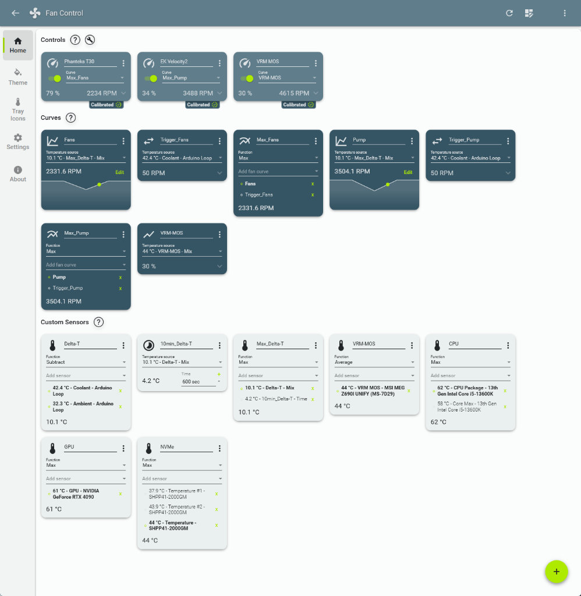
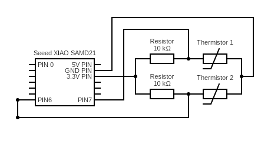

# Seeed-Studio-XIAO-SAMD21-Dual-Temperature-Sensor

This is a custom hardware monitoring plugin project for the Seeed Studio XIAO SAMD21 microcontroller reading two temperature sensors: one for a custom water cooling loop (**Coolant**) and one for room temperature (**Ambient**).

The microcontroller parses the thermistor readings and streams them over a serial USB COM port. This repository provides a custom, lightweight, zero-dependency C# plugin for FanControl that reads the serial COM port as the master reader and simultaneously publishes the data to Windows Performance Counters, allowing MSI Afterburner and RTSS to render the temperatures in-game.

## Features
* **Zero-Dependency Parser:** A streamlined string parser replaces bulky JSON libraries for low overhead.
* **FanControl Integration:** Drive custom Delta-T curves for pump and fans natively.
* **In-Game Overlay:** Windows Performance Counters integration feeds values directly into MSI Afterburner / RTSS.
* **Native Windows Compiler:** Compile the C# plugin directly on your machine without installing Visual Studio.

---

## Previews

### FanControl Custom Sensors & Delta-T Curves

### RTSS Floating Pill Overlay (In-Game)
*(Displayed at the top center of the screen)*

---

## Repository Architecture
* `arduino_sketch/`: Firmware sketch for the Seeed Studio XIAO SAMD21.
* `FanControl.CustomLoop/`: Pre-compiled plugin library (`FanControl.CustomLoop.dll`).
* `Sources/`: C# source code, the Performance Counter installation script (`CreateCounters.ps1`), and the native compilation batch script (`CompilerScript.bat`).
* `assets/`: Preview screenshots.

---

## Setup & Configuration
For complete step-by-step setup instructions for setting environment variables, installing the performance counters, and configuring MSI Afterburner / RTSS, please read our [CONFIGURATION.md](CONFIGURATION.md) guide.

---

## PART 1. The Sensors

Most watercooling temp sensors are 10k Ohm thermistors. This setup was built using:
* [Alphacool Eiszapfen inline temperature sensor | Part #17362](https://shop.alphacool.com/en/shop/controllers-and-sensors/temperature-sensor/17362-alphacool-eiszapfen-temperature-sensor-g1/4-ig/ig-with-ag-adapter-chrome)
* [Alphacool Eiszapfen temperature sensor plug | Part #17364](https://shop.alphacool.com/en/shop/controllers-and-sensors/temperature-sensor/17364-alphacool-eiszapfen-temperature-sensor-plug-g1/4-chrome)

For both, Alphacool provides the same [Thermistor Datasheet](https://www.alphacool.com/download/kOhm_Sensor_Table_Alphacool.pdf) which is useful to tune the calculated resistance values and improve accuracy. It also means that the parts can be connected to either port on the PCB.

*Tip on improving accuracy: Instead of assuming 10k resistors are exactly 10k, measure their actual value with a multimeter and use that as the reference in your code. It will be near 10k, but having a truer reference removes variations in measurement.*

---

## PART 2. Microcontroller

I opted for the Seeed Studio XIAO SAMD21. Just like the Adafruit Trinket M0, it can:
* Natively output serial via USB (which is great for splicing motherboards' internal USB2 headers).
* Be recognized in Windows as a standard COM device.

---

## PART 3. Assembly
1. Solder gold pins to the Seeed Studio XIAO SAMD21.
2. Wire as per the diagram below:

### Wiring Diagram

*(Created with [Circuit Diagram](https://www.circuit-diagram.org))*

### Explanation
As this microcontroller is unable to measure resistance directly, a voltage divider is used to measure the voltage and calculate the resistance at the junction between the resistor and the thermistor.

Use the **3.3V Pin** (not the 5V Pin). This microcontroller's logic is 3.3V based. Using the 5V supply will result in skewed measurements (e.g. water that is hot to the touch at ~50°C showing up in the range of 30°C).
